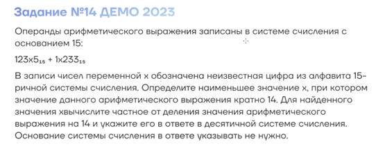
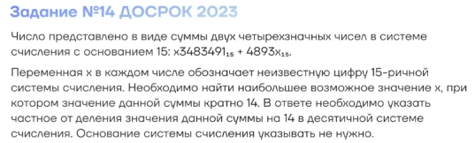
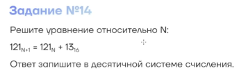
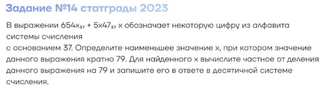
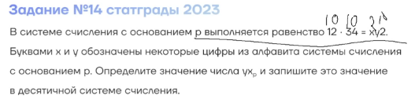
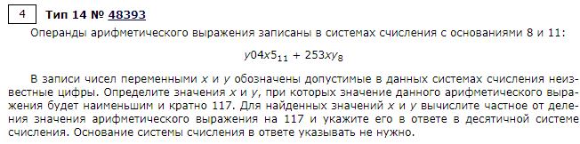
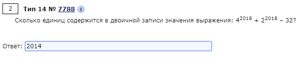

# 14 Задание ЕГЭ
Все команды возвращают строки

    bin(n) --> 2 система счисления
    oct(n) --> 8 система счисления
    hex(n) --> 16 система счисления

Перевод строк из N записи в десятичную

    int('1010', 2) // 1010 --> 10
    int('2110', 3) // 2110 --> 3

*Если в ручную посчитать, переводя в любую систему:*

    s = 134
    ans = []
    while s > 0:
        ans.append(s % 3)
        s = s // 3
        
    ans = [''.join(str(i)) for i in ans]
    ans = ''.join(ans)
    ans = ans[::-1]
    print(ans)  # --- 11222

## №1

## №2

## №3

## №4

## №5

## №6

## №7
