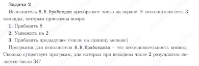

# Tasks

## №1
У исполнителя Утроитель две команды, которым присвоены номера:

    1) прибавь 1,
    2) умножь на 3.

Первая из них увеличивает число на экране на 1, вторая утраивает его.
Программа для Утроителя – это последовательность команд.
Сколько существует программ, которые число 2 преобразуют в число 32?

## №2

## №3

## №4

## №5

## №6

Исполнитель преобразует число на экране. У исполнителя есть две команды, которым присвоены номера:

    1. Прибавить 1
    2. Умножить на 3

Первая команда увеличивает число на экране на 1, вторая умножает его на 3. Программа для исполнителя  — это последовательность команд.

Сколько существует программ, которые преобразуют исходное число 2 в число 90, и при этом траектория вычислений содержит число 28?

## №7

Исполнитель РазДваТри преобразует число на экране.
У исполнителя есть три команды, которым присвоены номера:

    1.  Прибавить 1
    2.  Умножить на 2
    3.  Прибавить 3

Первая команда увеличивает число на экране на 1, вторая умножает его на 2, третья увеличивает на 3.
Программа для исполнителя РазДваТри  — это последовательность команд.

Сколько существует программ, которые преобразуют исходное число 3 в число 16 и при этом траектория вычислений не содержит чисел 6 и 12?

## №8

Исполнитель РазДваТри преобразует число на экране.
У исполнителя есть три команды, которым присвоены номера:

    1.  Прибавить 1
    2.  Прибавить 2
    3.  Умножить на 3

Первая команда увеличивает число на экране на 1, вторая увеличивает его на 2, третья умножает на 3.
Программа для исполнителя РазДваТри  — это последовательность команд.

Сколько существует программ, которые преобразуют исходное число 1 в число 15, и при этом траектория вычислений содержит число 9 и не содержит числа 13?
