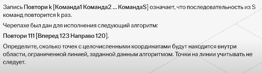
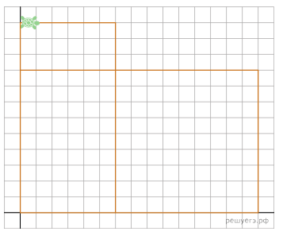

# Tasks

## №1

Учебный алгоритм Черепаха работает на плоскости с декартовой системой координат. В начальный момент Черепаха находится в начале координат, а её голова направлена вдоль положительного направления **оси абсцисс**, хвост опущен. Если у Черепахи опущен хвост, то она оставляет следы на поле в виде линий. В каждый конкретный момент известно положение исполнителя и направление его движения.

У исполнителя существует две команды: Вперёд n (где целое число), вызывающая передвижение Черепахи на п единиц в том направлении, куда указывает её голова, и Налево т (где целое число), вызывающая изменение направления движения на m градусов против. часовой стрелки.
Запись Повтори к [Команда1 Команда 2 ... КомандаЅ] означает, что последовательность из Ѕ команд повторится к раз.

Черепахе был дан для исполнения следующий алгоритм:

    Повтори 24 [Вперед 3 Налево 60].

Определите, сколько точек с целочисленными координатами будут находиться внутри области, ограниченной линией, заданной данным алгоритмом. Точки на линии учитывать не следует.

## 2

## 3 

Черепаха находится в начале координат, её голова направлена вдоль положительного направления оси ординат, хвост опущен.
Запись Повтори к [Команда1 Команда2 ... КомандаS] означает, что последовательность из S команд повторится к раз. Черепахе был дан для исполнения следующий алгоритм: 

    Направо 90
    Повтори 3 [Направо 45 Вперёд 12 Направо 45]
    Направо 315 Вперёд 12
    Повтори 2 [Направо 90 Вперёд 12].

Определите, сколько точек с целочисленными координатами будут находиться внутри области, которая ограничена линией, заданной алгоритмом. Точки на линий учитывать не следует.

## №4

Черепаха выполнила следующую программу:

    Повтори 4 [Вперёд 7 Направо 90 Вперёд 7 Налево 90 Вперёд 7 Направо 90]

Определите, сколько точек с целочисленными координатами будут находиться внутри области, ограниченной линией, полученной при выполнении данной программы. Точки, расположенные на линии, не учитывать.

## №5
В начальный момент Черепаха находится в начале координат, её голова направлена вдоль положительного направления оси ординат, хвост опущен
Повтори k [Команда1 Команда2 … КомандаS] означает, что последовательность из S команд повторится k раз. 

Черепахе был дан для исполнения следующий алгоритм:

    Повтори 6 [Направо 36 Вперёд 10 Направо 36]

Определите, сколько точек с целочисленными координатами будут находиться внутри области, ограниченной линией, заданной данным алгоритмом. Точки на линии учитывать не следует.

## №6
Запись Повтори k [Команда1 Команда2 . . . КомандаS] означает, что последовательность из S команд повторится k раз.

Черепахе был дан для исполнения следующий алгоритм:

    Повтори 2 [Вперёд 9 Направо 90 Вперёд 15 Направо 90]
    Поднять хвост
    Вперёд 12 Направо 90
    Опустить хвост
    Повтори 2 [Вперёд 6 Направо 90 Вперёд 12 Направо 90]

Определите, сколько точек с целочисленными координатами будут находиться **внутри объединения фигур**, ограниченных заданными алгоритмом линиями, не включая точки на границах этого объединения.

**Внутри объединения фигур** - то есть, нужно выбрать полное объеденинение фигур (включая внутренние границы, кроме внешних), а не их пересечение!
